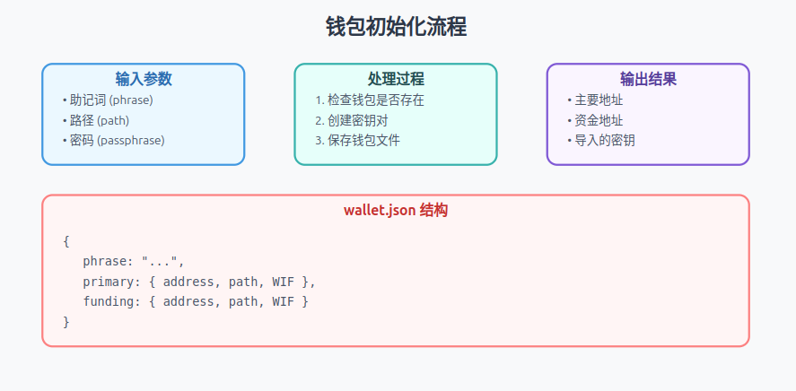

# **目录**

## **钱包 (Wallet Commands)**
- **[wallet-init-command.ts](#wallet-init-commandts)**  
  - 用于初始化一个新的钱包，生成必要的密钥对并保存配置。
- **[wallet-create-command.ts](#wallet-create-commandts)**  
  - 用于创建额外的钱包实例，但不进行初始化配置。
- **[wallet-import-command.ts](#wallet-import-commandts)**  
  - 用于导入现有钱包的私钥或助记词。
- **[wallet-info-command.ts](#wallet-info-commandts)**  
  - 用于查询并显示钱包信息，例如余额、地址或密钥元数据。
- **[wallet-phrase-decode-command.ts](#wallet-phrase-decode-commandts)**  
  - 用于解码钱包的助记词（种子短语）以生成对应的密钥材料。


## **铸造 (Minting Commands)**
- **[mint-interactive-nft-command.ts](#mint-interactive-nft-commandts)**  
  - 用于创建交互式NFT（非同质化代币）。
- **[mint-interactive-ft-command.ts](#mint-interactive-ft-commandts)**  
  - 用于创建交互式FT（同质化代币）。
- **[mint-interactive-realm-command.ts](#mint-interactive-realm-commandts)**  
  - 用于创建交互式领域（Realm）。
- **[mint-interactive-container-command.ts](#mint-interactive-container-commandts)**  
  - 用于创建交互式容器（Container）。
- **[mint-interactive-dft-command.ts](#mint-interactive-dft-commandts)**  
  - 用于创建去中心化的同质化代币（DFT，Decentralized FT）。


## **转账 (Transfer Commands)**
- **[transfer-interactive-ft-command.ts](#transfer-interactive-ft-commandts)**  
  - 用于转移同质化代币（FT）。
- **[transfer-interactive-nft-command.ts](#transfer-interactive-nft-commandts)**  
  - 用于转移非同质化代币（NFT）。
- **[transfer-interactive-utxos-command.ts](#transfer-interactive-utxos-commandts)**  
  - 用于管理UTXO（未花费交易输出）。
- **[transfer-interactive-builder-command.ts](#transfer-interactive-builder-commandts)**  
  - 用于构建和管理复杂的交易。

## **查询 (Query Commands)**
- **[get-by-ticker-command.ts](#get-by-ticker-commandts)**  
  - 用于通过代币的Ticker符号进行查询。
- **[get-by-realm-command.ts](#get-by-realm-commandts)**  
  - 用于通过领域（Realm）进行查询。
- **[get-by-container-command.ts](#get-by-container-commandts)**  
  - 用于通过容器（Container）进行查询。
- **[get-atomicals-address-command.ts](#get-atomicals-address-commandts)**  
  - 用于查询特定地址的原子化信息。


## **数据管理 (Data Management Commands)**
- **[set-container-data-interactive-command.ts](#set-container-data-interactive-commandts)**  
  - 用于管理容器（Container）相关数据。
- **[set-interactive-command.ts](#set-interactive-commandts)**  
  - 用于设置通用的数据。
- **[set-relation-interactive-command.ts](#set-relation-interactive-commandts)**  
  - 用于管理实体之间的关系数据。

# wallet-init-command.ts
## 功能概述


1. 钱包存在性检查：
```typescript
async walletExists() {
    if (await jsonFileExists(walletPath)) {
        return true;
    }
}
```
2. 密钥对创建：

```typescript
const { wallet, imported } = await createPrimaryAndFundingImportedKeyPairs(
    this.phrase,
    this.path,
    this.passphrase,
    this.n
);
```
3. 钱包文件结构：

```typescript
interface WalletStructure {
    phrase: string;           // 助记词
    passphrase?: string;      // 密码（可选）
    primary: {                // 主要地址
        address: string;      // 地址
        path: string;         // 路径
        WIF: string;         // WIF格式私钥
    };
    funding: {                // 资金地址
        address: string;
        path: string;
        WIF: string;
    };
    imported: any;            // 导入的密钥
}
```

## 使用示例
```typescript
// 创建钱包实例
const walletInit = new WalletInitCommand(
    "your seed phrase",      // 助记词
    "m/44'/0'/0'",          // 路径
    "optional passphrase",   // 可选密码
    1                        // 可选数量
);

// 执行初始化
try {
    const result = await walletInit.run();
    console.log(result.data);
} catch (error) {
    console.error('钱包初始化失败:', error);
}
```

# wallet-create-command.ts
## 功能概述
`WalletCreateCommand` 是一个简单但重要的命令，用于创建新的比特币钱包密钥对。它与 `WalletInitCommand` 不同的是，它只生成密钥对而不保存到文件。

### 密钥对生成
- 直接调用 `createPrimaryAndFundingImportedKeyPairs` 工具函数
- 生成主要地址和资金地址的密钥对

# wallet-import-command.ts
## 功能概述
`wallet-import-command.ts` 实现了比特币钱包私钥导入功能，允许用户通过 WIF（Wallet Import Format）格式导入已存在的私钥，并为其分配别名。

## 主要步骤
1. 钱包检查:

```typescript
async walletExists() {
    if (await jsonFileExists(walletPath)) {
        return true;
    }
}
```
2. 导入过程:

```typescript
// 读取现有钱包文件
const walletFileData = await jsonFileReader(walletPath);

// 检查别名是否已存在
if (walletFileData.imported.hasOwnProperty(this.alias)) {
    throw `Wallet alias ${this.alias} already exists!`;
}

// 创建备份
await jsonFileWriter(
    walletPath + '.' + (new Date()).getTime() + '.walletbackup', 
    walletFileData
);
```
3. 密钥处理:

```typescript
// 从WIF创建密钥对
const importedKeypair = ECPair.fromWIF(this.wif);

// 创建Taproot地址
const { address, output } = bitcoin.payments.p2tr({
    internalPubkey: toXOnly(importedKeypair.publicKey),
    network: NETWORK
});
```

## 使用示例：
```typescript
// 创建导入命令实例
const importCommand = new WalletImportCommand(
    "KxDQYWM...private_key_wif",  // WIF私钥
    "savings-account"             // 别名
);

try {
    const result = await importCommand.run();
    console.log(`地址 ${result.data.address} 已导入为 ${result.data.alias}`);
} catch (error) {
    console.error('导入失败:', error);
}
```
# wallet-info-command.ts
## 功能概述

## 主要步骤
1. 余额查询功能 (Balance Query)：
```typescript
// 余额相关变量
let total_confirmed = 0;      // 已确认总额
let total_unconfirmed = 0;    // 未确认总额
let regular_confirmed = 0;    // 普通币已确认
let atomicals_confirmed = 0;  // 特殊代币已确认
```
2. UTXO 管理 (UTXO Management)：
```
// UTXO 分类存储
const plainUtxos: any[] = [];      	// 普通 UTXO 数组
const atomicalsUtxos: any[] = [];  	// 特殊代币 UTXO 数组

// UTXO 处理示例
for (const utxo of res.utxos) {
  if (utxo.atomicals && utxo.atomicals.length) {
    atomicalsUtxos.push(utxo);  	// 特殊代币
  } else {
    plainUtxos.push(utxo);      	// 普通币
  }
}
```

3. 交易历史查询 (Transaction History)：

```
// 详细模式下获取交易历史
if (this.verbose) {
  history = await this.electrumApi.history(scripthash);
}
```

## 使用示例：
```typescript
// 创建钱包信息命令实例
const wallet = new WalletInfoCommand(
  electrumApi,         // API 接口
  'bc1q....',         // 比特币地址
  true                // 是否需要详细信息
);

// 执行查询
const result = await wallet.run();

// 输出结果示例
console.log(result.data);
/* 输出格式
{
  address: 'bc1q....',           // 钱包地址
  scripthash: '7d8c...',        // 脚本哈希
  atomicals_count: 2,           // 特殊代币数量
  total_confirmed: 150000,      // 已确认总额
  regular_utxos: [...],         // 普通 UTXO 列表
  atomicals_utxos: [...],       // 特殊代币 UTXO 列表
  history: [...],               // 交易历史（详细模式）
}
*/
```


# wallet-phrase-decode-command.ts
## 功能概述


```typescript
export class WalletPhraseDecodeCommand implements CommandInterface {
    // 1️⃣ 构造函数：接收必要参数
    constructor(
        private phrase: string,     // 助记词
        private path: string,       // 派生路径
        private passphrase?: string // 可选密码
    ) {}

    // 2️⃣ 运行函数：执行解码过程
    async run(): Promise<CommandResultInterface> {
        const wallet = await decodeMnemonicPhrase(
            this.phrase, 
            this.path, 
            this.passphrase
        );
        return {
            success: true,
            data: wallet
        }
    }
}
```

## 使用示例
```typescript
// 创建解码命令
const decodeCommand = new WalletPhraseDecodeCommand(
    "apple banana cherry ...", // 你的12/24个助记词
    "m/44'/0'/0'/0/0",        // BIP44路径
    "optional passphrase"      // 可选密码
);

// 执行解码
try {
    const result = await decodeCommand.run();
    if (result.success) {
        const { address, privateKey } = result.data;
        console.log('钱包地址:', address);
    }
} catch (error) {
    console.error('解码失败:', error);
}
```

---
# mint-interactive-nft-command.ts
## 功能概述
`MintInteractiveNftCommand` 类专门用于铸造非同质化代币(NFT)。本命令处理整个NFT的创建过程，包括数据验证、交易构建和网络广播。

## 主要步骤

1. NFT数据构建

```typescript
const atomicalBuilder = new AtomicalOperationBuilder({
    electrumApi: this.electrumApi,         // API接口
    rbf: this.options.rbf,                 // 替换手续费选项
    satsbyte: this.options.satsbyte,       // 每字节聪数
    address: this.address,                 // 接收地址
    disableMiningChalk: this.options.disableMiningChalk,
    opType: 'nft',                        // 操作类型：NFT
    nftOptions: {
        satsoutput: this.options.satsoutput
    }
});
```
2. 数据处理流程

```typescript
// 处理NFT文件数据
let filesData: any = null;
if (this.jsonOnly) {
    // JSON专用模式
    filesData = await readJsonFileAsCompleteDataObjectEncodeAtomicalIds(
        this.filename
    );
} else {
    // 常规文件处理模式
    filesData = await prepareFilesDataAsObject([this.filename]);
}
```
3. 可选配置项

```typescript
// 容器配置 (Container)
if (this.options.container) {
    atomicalBuilder.setContainerMembership(this.options.container);
}

// 比特工作配置 (Bitwork)
if (this.options.bitworkc) {
    atomicalBuilder.setBitworkCommit(this.options.bitworkc);
}
if (this.options.bitworkr) {
    atomicalBuilder.setBitworkReveal(this.options.bitworkr);
}

// 父级设置
if (this.options.parent) {
    atomicalBuilder.setInputParent(
        await AtomicalOperationBuilder.resolveInputParent(
            this.electrumApi,
            this.options.parent,
            this.options.parentOwner
        )
    );
}
```

## 使用示例
```typescript
// 基础铸造
// 创建NFT铸造实例
const mintNFT = new MintInteractiveNftCommand(
    electrumApi,                // Electrum API实例
    {
        satsbyte: 10,          // 设置每字节10聪
        rbf: true,             // 启用RBF
        satsoutput: 1000       // 输出1000聪
    },
    "my-nft-data.json",        // NFT数据文件
    "bc1q...",                 // 接收地址
    "KxDQYWM..."               // 资金私钥
);

// 执行铸造
```

# mint-interactive-ft-command.ts
## 功能概述
`MintInteractiveFtCommand` 是一个用于铸造同质化代币(FT - Fungible Token)的交互式命令类。它处理代币的创建过程，包括代币名称验证、供应量设置和交易构建。

## 主要步骤

1. 初始化检查

```typescript
// 代币符号处理和验证
this.requestTicker = this.requestTicker.startsWith('$') ? 
    this.requestTicker.substring(1) : this.requestTicker;
isValidTickerName(requestTicker);
isValidBitworkMinimum(this.options.bitworkc);
```
2. 交互式确认

```typescript
console.log('Initializing Direct FT Token')
console.log('-----------------------')
console.log('Total Supply (Satoshis): ', this.supply);
console.log('Total Supply (BTC): ', this.supply / 100000000);
console.log('Data objects: ', filesData);
// 等待用户确认
await promptContinue();
```
3. 代币名称验证

```typescript
// 检查代币名称是否已存在
const getExistingNameCommand = new GetByTickerCommand(
    this.electrumApi, 
    this.requestTicker, 
    AtomicalsGetFetchType.GET
);
// 如果代币名称已存在则抛出错误
```

4. 代币构建配置

```typescript
const atomicalBuilder = new AtomicalOperationBuilder({
    electrumApi: this.electrumApi,
    rbf: this.options.rbf,                // 是否启用RBF
    satsbyte: this.options.satsbyte,      // 每字节费用
    address: this.address,                // 接收地址
    opType: 'ft',                        // 操作类型：同质化代币
    ftOptions: {
        fixedSupply: this.supply,         // 固定供应量
        ticker: this.requestTicker,       // 代币符号
    },
    meta: this.options.meta,              // 元数据
    ctx: this.options.ctx,                // 上下文
    init: this.options.init,              // 初始化数据
});
```

## 使用示例
```typescript
// 创建FT铸造命令实例
const mintFT = new MintInteractiveFtCommand(
    electrumApi,           // Electrum API实例
    {
        satsbyte: 10,     // 设置每字节10聪
        rbf: true,        // 启用RBF
        meta: {           // 元数据
            name: "MyToken",
            description: "My first fungible token"
        }
    },
    "token-metadata.json", // 元数据文件
    1000000,              // 供应量：1,000,000聪
    "bc1q...",            // 接收地址
    "MyToken",            // 代币符号
    "KxDQYWM..."          // 资金私钥
);

// 执行铸造
try {
    const result = await mintFT.run();
    console.log('代币铸造成功:', result.data);
} catch (error) {
    console.error('代币铸造失败:', error);
}
```

## NFT与FT铸造流程对比

NFT特有的处理
```typescript
// NFT需要处理文件数据
if (this.jsonOnly) {
    filesData = await readJsonFileAsCompleteDataObjectEncodeAtomicalIds(this.filename);
} else {
    filesData = await prepareFilesDataAsObject([this.filename]);
}
```

FT特有的处理
```typescript
// FT需要处理供应量
console.log('Total Supply (Satoshis): ', this.supply);
console.log('Total Supply (BTC): ', this.supply / 100000000);
await promptContinue();  // 用户确认步骤
```

共同的基础配置
```typescript
const commonConfig = {
    electrumApi: this.electrumApi,
    rbf: this.options.rbf,
    satsbyte: this.options.satsbyte,
    address: this.address
};
```

# mint-interactive-realm-command.ts
## 功能概述
Realm（领域）是一种特殊的NFT，用于创建唯一的命名空间或域名。它以 + 符号开头，类似于域名系统。


## 主要步骤

1. 名称处理和验证

```typescript
// 移除+前缀（如果存在）
this.requestRealm = this.requestRealm.startsWith('+') ? 
    this.requestRealm.substring(1) : 
    this.requestRealm;

// 验证工作量要求
isValidBitworkMinimum(this.options.bitworkc);
```
2. 名称可用性检查

```typescript
const getExistingNameCommand = new GetByRealmCommand(
    this.electrumApi,
    this.requestRealm,
    AtomicalsGetFetchType.GET
);

// 检查是否已存在
try {
    const result = await getExistingNameCommand.run();
    if (result.success && result.data) {
        throw '该名称已存在，请尝试其他名称';
    }
} catch (err) {
    // 错误码1表示未找到，这是期望的结果
    if (err.code !== 1) {
        throw err;
    }
}
```
3. 构建Realm操作

```typescript
const atomicalBuilder = new AtomicalOperationBuilder({
    electrumApi: this.electrumApi,
    rbf: this.options.rbf,
    satsbyte: this.options.satsbyte,
    address: this.address,
    opType: 'nft',                    // Realm基于NFT类型
    nftOptions: {
        satsoutput: this.options.satsoutput || 1000
    },
    meta: this.options.meta,          // 元数据
    ctx: this.options.ctx,            // 上下文数据
    init: this.options.init,          // 初始化数据
});

// 设置Realm请求
atomicalBuilder.setRequestRealm(this.requestRealm);
```

4. 可选配置项

```typescript
// 设置容器成员关系
if (this.options.container) {
    atomicalBuilder.setContainerMembership(this.options.container);
}

// 设置工作量证明
if (this.options.bitworkc) {
    atomicalBuilder.setBitworkCommit(this.options.bitworkc);
}
if (this.options.bitworkr) {
    atomicalBuilder.setBitworkReveal(this.options.bitworkr);
}

// 设置父级
if (this.options.parent) {
    atomicalBuilder.setInputParent(
        await AtomicalOperationBuilder.resolveInputParent(
            this.electrumApi,
            this.options.parent,
            this.options.parentOwner
        )
    );
}
```

## 使用示例
```typescript
// 创建Realm铸造命令
const mintRealm = new MintInteractiveRealmCommand(
    electrumApi,              // Electrum API实例
    {
        satsbyte: 10,        // 每字节10聪
        rbf: true,           // 启用RBF
        bitworkc: "123",     // 可选: commit工作量
        meta: {              // 可选: 元数据
            description: "My First Realm"
        }
    },
    "+myrealmname",          // 领域名称（带+前缀）
    "bc1q...",              // 接收地址
    "KxDQYWM..."            // 资金私钥
);

// 执行铸造
try {
    const result = await mintRealm.run();
    console.log('领域铸造成功:', result.data);
} catch (error) {
    console.error('领域铸造失败:', error);
}
```