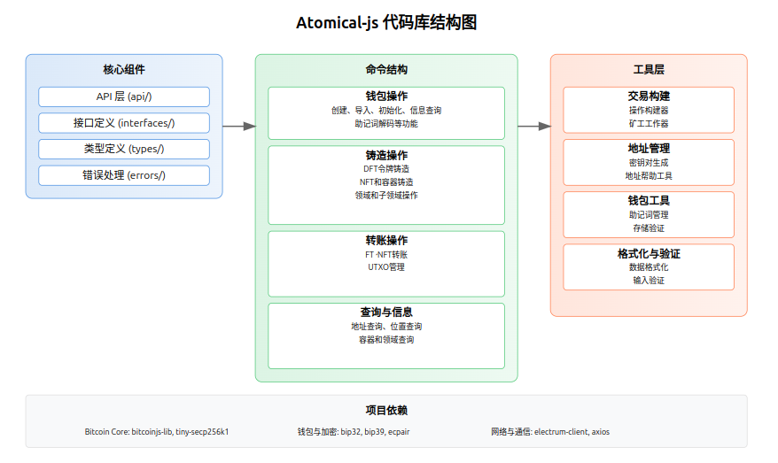

# Atomicals-js 文档中心


### 核心文档
[基础架构](./nav.md)

## 项目概述

Atomicals-js 是一个用于在比特币网络上创建和管理数字资产的 JavaScript/TypeScript 工具库。它提供了完整的命令行界面（CLI）和程序化 API，让开发者能够方便地操作 Atomicals 协议中的各类数字资产。

### 主要特性
- 支持多种数字资产类型管理
- 完整的钱包功能
- 安全的密钥管理
- 灵活的交易处理
- 丰富的查询接口

## 核心组件

### 1. 关键依赖
核心依赖包含：

```json
{
  "dependencies": {
    "bitcoinjs-lib": "^6.1.0",    // 比特币操作库
    "bip32": "^3.1.0",            // 密钥派生
    "bip39": "^3.1.0",            // 助记词管理
    "electrum-client": "^1.1.0",   // ElectrumX 客户端
    "commander": "^9.4.1"          // CLI 框架
  }
}
```

## 开发环境配置

### 1. 环境准备
首先需要配置开发环境：

```bash
# 安装依赖
yarn install

# 配置环境变量
cp .env.example .env

# 编译项目
yarn build
```

### 2. 钱包配置
创建并配置钱包：

```typescript
// 初始化钱包
const initWallet = async () => {
  const mnemonic = generateMnemonic();  // 生成助记词
  const wallet = await Wallet.fromMnemonic(mnemonic);
  
  console.log("钱包地址:", wallet.address);
  console.log("请妥善保管助记词:", mnemonic);
};
```

## 常用命令指南

### 1. 钱包管理命令 (Wallet Management)
钱包是您与比特币网络交互的基础。就像您的银行账户一样，它存储了您的数字资产。

```bash
# 创建新钱包（就像开设新的银行账户）
yarn cli wallet-create

# 初始化钱包配置文件
yarn cli wallet-init

# 导入已有钱包（类似于在新设备上登录您的账户）
yarn cli wallet-import <私钥> <别名>

# 查看钱包余额
yarn cli balances
```

### 2. 地址操作命令 (Address Operations)
地址就像您的银行账号，用于接收和发送数字资产。

```bash
# 查询地址信息（就像查看账户详情）
yarn cli address <地址>

# 查看地址的所有UTXO（未花费的交易输出，类似于账户中的零钱）
yarn cli address-utxos <地址>

# 查看地址历史（类似于查看账单记录）
yarn cli address-history <地址>
```

### 3. 资产管理命令 (Asset Management)

#### NFT 操作
非同质化代币(NFT)就像独一无二的艺术品或收藏品。

```bash
# 创建新的NFT（类似于创作一件艺术品）
yarn cli mint-nft <配置文件>

# 转移NFT到新地址（类似于将艺术品送给他人）
yarn cli transfer-nft <NFT编号> <接收地址>
```

#### FT（同质化代币）操作
同质化代币类似于货币，每个单位都是相同的。

```bash
# 创建新代币（类似于发行新的货币）
yarn cli mint-ft <代币符号> <供应量> <配置文件>

# 转移代币（类似于转账）
yarn cli transfer-ft <代币编号>
```

### 4. 域名系统命令 (Realm System)
域名系统类似于互联网的域名，提供易记的名称。

```bash
# 注册顶级域名（类似于注册.com域名）
yarn cli mint-realm <域名>

# 注册子域名（类似于注册子域名，如 blog.example.com）
yarn cli mint-subrealm <子域名>
```

### 5. 容器操作命令 (Container Operations)
容器就像一个数字化的收藏夹，可以存储多个相关的数字资产。

```bash
# 创建新容器（类似于创建新的收藏夹）
yarn cli mint-container <容器名称>

# 查看容器内容（类似于浏览收藏夹）
yarn cli get-container <容器名称>
```

### 实用技巧

1. **命令帮助**
```bash
# 查看任何命令的详细帮助
yarn cli help <命令名称>
```

2. **常见操作流程**

初学者建议按以下顺序学习：

a) 钱包管理
```bash
# 第一步：创建钱包
yarn cli wallet-create

# 第二步：查看余额
yarn cli balances
```

b) 创建第一个NFT
```bash
# 准备NFT配置文件 config.json
{
  "name": "我的第一个NFT",
  "description": "这是一个测试NFT",
  "image": "ipfs://..."
}

# 铸造NFT
yarn cli mint-nft config.json
```