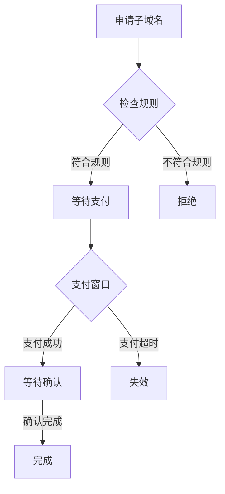

# Atomicals-js 领域管理命令

## 功能概述
领域（Realm）系统是Atomicals协议中的一个核心组件，它提供了一个分层的命名空间管理系统，类似于传统的域名系统（DNS）。每个领域都可以有多个子领域（Subrealm），形成一个层级结构。

## 命令列表


- **[enable-subrealm-rules-command.ts](#enable-subrealm-rules-commandts)**  
  - 启用子领域规则
- **[disable-subrealm-rules-command.ts](#disable-subrealm-rules-commandts)**  
  - 禁用子领域规则
- **[get-subrealm-info-command.ts](#get-subrealm-info-commandts)**  
  - 获取子领域信息
- **[pending-subrealms-command.ts](#pending-subrealms-commandts)**  
  - 获取待处理的子领域  

### 核心概念

1. **领域（Realm）**
   - 以"+"符号开头的唯一标识符
   - 作为顶级命名空间存在
   - 例如：`+mycompany`

2. **子领域（Subrealm）**
   - 从属于某个领域的二级命名空间
   - 使用点号分隔层级
   - 例如：`+mycompany.department`

3. **规则系统**
   - 控制子领域的创建和管理
   - 包含支付规则和验证规则
   - 可以动态启用或禁用

## 命令详解

# enable-subrealm-rules-command.ts

## 工作原理
这个命令用于启用领域的子域名规则系统。它的工作流程如下：

1. **规则文件验证**
   ```typescript
   let filesData = await readJsonFileAsCompleteDataObjectEncodeAtomicalIds(this.file, false);
   ```
   - 读取JSON格式的规则配置文件
   - 验证规则的格式和内容
   - 支持引用其他Atomicals ID

2. **Atomical验证**
   ```typescript
   const { atomicalInfo, locationInfo, inputUtxoPartial } = await getAndCheckAtomicalInfo(
     this.electrumApi, 
     this.atomicalId, 
     this.owner.address, 
     'NFT', 
     null
   );
   ```
   - 检查Atomical是否存在
   - 验证所有权
   - 获取UTXO信息

3. **规则更新操作**
   ```typescript
   const atomicalBuilder = new AtomicalOperationBuilder({
     opType: 'mod',  // 使用mod操作类型
     // ...其他配置
   });
   ```
   - 创建修改操作
   - 设置新的规则数据
   - 添加必要的输出

#### 规则配置示例
```json
{
  "subrealms": {
    "rules": [
      {
        "p": ".*",           // 正则表达式匹配子域名
        "o": {              // 输出规则
          "v": 1000000,    // 价格（聪）
          "id": "arc20_id" // 可选：指定ARC20代币
        }
      }
    ]
  }
}
```

# disable-subrealm-rules-command.ts

## 工作原理
禁用命令通过以下步骤关闭子域名规则：

1. **状态验证**
   - 检查当前规则状态
   - 验证操作权限
   - 确保没有待处理的子域名请求

2. **规则清除**
   ```typescript
   await atomicalBuilder.setData({
     subrealms: true,  // 标记为启用状态
     $a: 1            // 协议版本标识
   });
   ```
   - 移除现有规则
   - 保持基本配置
   - 更新状态标记

3. **交易构建**
   - 创建修改操作
   - 添加所有者签名
   - 广播交易

# get-subrealm-info-command.ts

## 信息查询机制
该命令提供全面的子域名信息查询：

1. **信息聚合**
   ```typescript
   const responseResult = await this.electrumApi.atomicalsGetRealmInfo(this.realmOrSubrealm);
   ```
   - 基本信息查询
   - 规则状态查询
   - 所有权信息

2. **数据结构**
   ```typescript
   interface SubrealmInfo {
     atomical_id: string;      // Atomical ID
     atomical_number: number;  // 序号
     status: {                // 状态信息
       status: string;       // 当前状态
       pending_candidate_atomical_id?: string;
     };
     rules?: {               // 规则配置
       enabled: boolean;
       patterns: Array<any>;
     };
   }
   ```

# get-by-realm-command.ts

## 查询处理流程

1. **多级查询**
   ```typescript
   const responseResult = await this.electrumApi.atomicalsGetRealmInfo(this.realm);
   ```
   - 支持完整路径查询
   - 处理重定向
   - 验证每一级

2. **数据装饰**
   ```typescript
   const updatedRes = Object.assign({},
     getDefaultCommandResponse.data,
     {
       result: decorateAtomical(getDefaultCommandResponse.data.result)
     }
   );
   ```
   - 添加人类可读信息
   - 计算派生字段
   - 格式化输出

# pending-subrealms-command.ts

## 工作机制
这个命令管理子域名的申请和支付流程：

1. **状态跟踪**
   ```typescript
   static isPendingCandidate(entry): boolean {
     switch (entry['request_subrealm_status']['status']) {
       case 'pending_awaiting_confirmations_payment_received_prematurely':
       case 'pending_awaiting_confirmations_for_payment_window':
       case 'pending_awaiting_confirmations':
       case 'pending_awaiting_payment':
         // ...
     }
   }
   ```
   - 跟踪多种待处理状态
   - 处理支付窗口
   - 管理确认过程

2. **支付处理**
   ```typescript
   async makePayment(atomicalId: string, paymentOutputs: Array<{ address: string, value: number }>) {
     // 构建支付交易
     // 添加支付输出
     // 包含支付凭证
   }
   ```
   - 构建支付交易
   - 处理多种支付类型
   - 生成支付凭证

3. **用户交互**
   - 显示待处理请求
   - 提供支付选项
   - 显示状态更新

## 状态流转图

