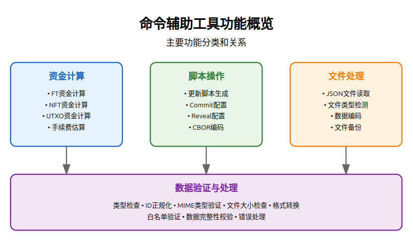

# Atomicals-js 核心基础设施

核心基础设施模块提供了Atomicals-js的基础框架和工具，是整个系统的核心支柱。

## 命令列表
- **[command.interface.ts](#command-interface-ts)**  
    - 命令接口定义
- **[command-helpers.ts](#command-helpers-ts)**  
    - 命令辅助函数
- **[witness_stack_to_script_witness.ts](#witness_stack_to_script_witness-ts)**  
    - 见证栈转换工具

## 命令接口定义 (command.interface.ts)

### 功能概述
命令接口（CommandInterface）是所有Atomicals命令的基础。它定义了一个简单但强大的合约，所有命令都必须遵循这个合约。

### 枚举类型定义
```typescript
export enum AtomicalsGetFetchType {
    GET = 'GET',           // 基本获取操作
    LOCATION = 'LOCATION', // 位置信息获取
    STATE = 'STATE',       // 状态信息获取
    STATE_HISTORY = 'STATE_HISTORY',   // 状态历史获取
    EVENT_HISTORY = 'EVENT_HISTORY',   // 事件历史获取
    TX_HISTORY = 'TX_HISTORY'          // 交易历史获取
}
```

### 命令接口定义
```typescript
export interface CommandInterface {
    run: () => Promise<CommandResultInterface>;
}
```

核心接口说明：
1. `run()` 方法
   - 返回类型：`Promise<CommandResultInterface>`
   - 功能：执行命令的主要逻辑
   - 异步操作：使用Promise处理异步任务
   - 结果返回：通过CommandResultInterface规范返回格式

### 实现示例
```typescript
class SimpleGetCommand implements CommandInterface {
    constructor(
        private api: ElectrumApiInterface,
        private id: string,
        private fetchType: AtomicalsGetFetchType
    ) {}

    async run(): Promise<CommandResultInterface> {
        try {
            // 根据fetchType获取不同数据
            switch (this.fetchType) {
                case AtomicalsGetFetchType.GET:
                    const data = await this.api.getBasicInfo(this.id);
                    return {
                        success: true,
                        data: data
                    };
                    
                case AtomicalsGetFetchType.LOCATION:
                    // 获取位置信息
                    break;
                    
                // ... 其他类型处理
            }
        } catch (error) {
            return {
                success: false,
                error: error.message
            };
        }
    }
}
```

## 命令辅助函数 (command-helpers.ts)

### 功能概述
`command-helpers.ts` 提供了一套全面的辅助函数，用于简化Atomicals命令的实现和处理常见操作。这些函数涵盖了从文件处理到交易构建的各个方面。



### 核心功能

#### 1. 环境配置
```typescript
// 设置网络环境（主网/测试网）
export const NETWORK = process.env.NETWORK === 'testnet' ? 
    networks.testnet : 
    process.env.NETWORK == "regtest" ? 
        networks.regtest : 
        networks.bitcoin;

// RBF（Replace-By-Fee）配置
export const RBF_INPUT_SEQUENCE = 0xfffffffd;
```

#### 2. 费用计算函数
```typescript
export const calculateFundsRequired = (
    additionalInputValue: number,   // 额外输入值
    atomicalSats: number,          // Atomicals聪数
    satsByte: number,             // 每字节费用
    mintDataLength = 0,           // 铸造数据长度
    baseTxByteLength = 300        // 基础交易字节长度
) => {
    // 计算预估交易大小和所需费用
    const estimatedTxSizeBytes = baseTxByteLength + mintDataLength;
    const expectedFee = estimatedTxSizeBytes * satsByte;
    // ...
}
```

#### 3. 文件处理函数
```typescript
// 读取文件为Atomical数据格式
export const readAsAtomicalFileData = async (
    file: string,
    alternateName?: string
): Promise<AtomicalFileData> => {
    // ...
}

// 准备文件数据
export const prepareFilesData = async (fields: string[]) => {
    // 支持多种文件格式和数据类型
    // ...
}
```

#### 4. CBOR编码处理
```typescript
// 添加铸造/更新脚本
export const appendMintUpdateRevealScript = (
    opType: 'nft' | 'ft' | 'dft' | 'dmt' | 'sl' | 'x' | 'y' | 'z' | 'mod' | 'evt',
    keypair: KeyPairInfo,
    files: AtomicalFileData[],
    log: boolean = true
) => {
    // 构建脚本操作
    // ...
}
```

#### 5. Atomicals标识符处理
```typescript
// 标识符规范化
export const normalizeIdentifier = (
    id: any,
    expectedType?: AtomicalIdentifierType
): string => {
    // 处理容器名称（#）
    // 处理域名（+）
    // 处理代币符号（$）
    // ...
}
```

### 主要工具类

#### AtomicalsPayload 类
```typescript
export class AtomicalsPayload {
    constructor(private originalData: any) {
        // 验证数据类型
        // CBOR编码
        // 完整性检查
    }
    
    // 获取原始数据
    get(): any
    
    // 获取CBOR编码数据
    cbor(): any
}
```

### 关键功能

1. **交易构建辅助**
   - 计算所需资金
   - 准备提交和显示配置
   - UTXO管理

2. **数据验证和转换**
   - 文件格式验证
   - 数据类型检查
   - CBOR编码/解码

3. **标识符处理**
   - 容器名称规范化
   - 域名规范化
   - 代币符号规范化

4. **文件系统操作**
   - 文件读取
   - MIME类型处理
   - 数据格式转换

### 使用示例

1. **计算交易费用**
```typescript
const { expectedSatoshisDeposit, expectedFee } = calculateFundsRequired(
    1000,    // 额外输入值
    10000,   // Atomicals数量
    2,       // 每字节2聪
    500      // 数据长度
);
```

2. **处理文件数据**
```typescript
// 准备文件数据
const filesData = await prepareFilesData([
    'image.png',                    // 直接使用文件名
    'metadata,custom.json',         // 使用自定义名称
    'description={"text":"Hello"}'  // 直接设置字段值
]);
```

3. **标识符处理**
```typescript
const realmName = normalizeIdentifier('myRealm', AtomicalIdentifierType.REALM_NAME);
// 结果: +myRealm

const containerName = normalizeIdentifier('myContainer', AtomicalIdentifierType.CONTAINER_NAME);
// 结果: #myContainer
```

## witness_stack_to_script_witness.ts

### 功能概述
`witness_stack_to_script_witness.ts` 是一个专门用于比特币隔离见证（Segregated Witness，SegWit）交易的工具。它负责将见证数据转换为脚本见证格式，是处理SegWit交易的关键组件。

### 核心实现
```typescript
export function witnessStackToScriptWitness(witness: Buffer[]) {
    let buffer = Buffer.allocUnsafe(0)

    // 写入数据片段
    function writeSlice(slice: Buffer) {
        buffer = Buffer.concat([buffer, Buffer.from(slice)])
    }

    // 写入可变整数
    function writeVarInt(i: number) {
        const currentLen = buffer.length;
        const varintLen = varuint.encodingLength(i)
        buffer = Buffer.concat([buffer, Buffer.allocUnsafe(varintLen)])
        varuint.encode(i, buffer, currentLen)
    }

    // 写入可变长度数据片段
    function writeVarSlice(slice: Buffer) {
        writeVarInt(slice.length)
        writeSlice(slice)
    }

    // 写入向量数据
    function writeVector(vector: Buffer[]) {
        writeVarInt(vector.length)
        vector.forEach(writeVarSlice)
    }

    writeVector(witness)
    return buffer
}
```

### 功能说明

1. **数据序列化**
   - 将见证数据转换为标准的比特币脚本格式
   - 处理可变长度的整数和数据
   - 生成符合比特币协议的序列化输出

2. **内部函数**
   - `writeSlice`: 写入固定长度数据
   - `writeVarInt`: 写入可变长度整数
   - `writeVarSlice`: 写入带长度前缀的数据
   - `writeVector`: 写入数组类型数据

3. **使用场景**
   - SegWit交易构建
   - 见证脚本序列化
   - 交易签名处理

### 使用示例

```typescript
// 创建见证数据
const witnessData = [
    Buffer.from('signature', 'hex'),
    Buffer.from('pubkey', 'hex')
];

// 转换为脚本见证格式
const scriptWitness = witnessStackToScriptWitness(witnessData);
```

### 技术细节

1. **Buffer处理**
   ```typescript
   // 初始化空buffer
   let buffer = Buffer.allocUnsafe(0)
   
   // 连接buffer
   buffer = Buffer.concat([buffer, Buffer.from(slice)])
   ```

2. **可变整数编码**
   ```typescript
   // 获取编码长度
   const varintLen = varuint.encodingLength(i)
   
   // 编码整数
   varuint.encode(i, buffer, currentLen)
   ```

3. **数据序列化过程**
   ```typescript
   // 1. 写入向量长度
   writeVarInt(vector.length)
   
   // 2. 对每个元素
   vector.forEach(element => {
       // 2.1 写入元素长度
       writeVarInt(element.length)
       // 2.2 写入元素数据
       writeSlice(element)
   })
   ```

### 重要说明

1. **性能考虑**
   - 使用 `Buffer.allocUnsafe` 提高性能
   - 避免不必要的数据复制
   - 优化内存使用

2. **兼容性**
   - 符合比特币协议规范
   - 支持所有SegWit版本
   - 保持向后兼容性

3. **安全性**
   - 验证输入数据
   - 处理边界情况
   - 确保数据完整性
