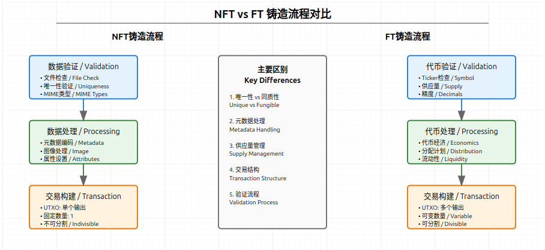
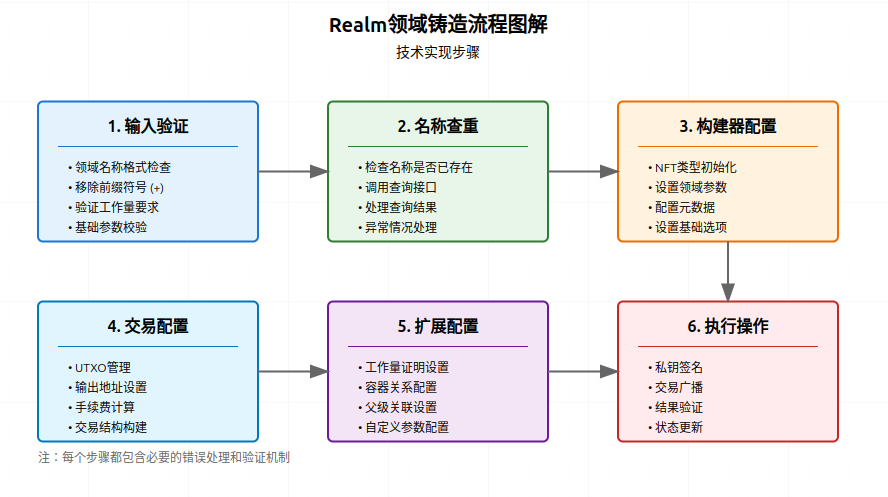

# Atomicals-js 铸造命令

## 铸造命令概述

铸造命令用于创建各种类型的数字资产，包括NFT（非同质化代币）、FT（同质化代币）、域名等。本文档详细介绍了所有铸造相关的命令操作。

## 命令列表
- **[mint-interactive-nft-command.ts](#mint-interactive-nft-commandts)**  
  - 用于创建交互式NFT（非同质化代币）。
- **[mint-interactive-ft-command.ts](#mint-interactive-ft-commandts)**  
  - 用于创建交互式FT（同质化代币）。
- **[mint-interactive-realm-command.ts](#mint-interactive-realm-commandts)**  
  - 用于创建交互式领域（Realm）。
- **[mint-interactive-container-command.ts](#mint-interactive-container-commandts)**  
  - 用于创建交互式容器（Container）。
- **[mint-interactive-dft-command.ts](#mint-interactive-dft-commandts)**  
  - 用于创建去中心化的同质化代币（DFT，Decentralized FT）。

# mint-interactive-nft-command.ts
## 功能概述
`MintInteractiveNftCommand` 类专门用于铸造非同质化代币(NFT)。本命令处理整个NFT的创建过程，包括数据验证、交易构建和网络广播。

## 主要步骤

1. NFT数据构建

```typescript
const atomicalBuilder = new AtomicalOperationBuilder({
    electrumApi: this.electrumApi,         // API接口
    rbf: this.options.rbf,                 // 替换手续费选项
    satsbyte: this.options.satsbyte,       // 每字节聪数
    address: this.address,                 // 接收地址
    disableMiningChalk: this.options.disableMiningChalk,
    opType: 'nft',                        // 操作类型：NFT
    nftOptions: {
        satsoutput: this.options.satsoutput
    }
});
```
2. 数据处理流程

```typescript
// 处理NFT文件数据
let filesData: any = null;
if (this.jsonOnly) {
    // JSON专用模式
    filesData = await readJsonFileAsCompleteDataObjectEncodeAtomicalIds(
        this.filename
    );
} else {
    // 常规文件处理模式
    filesData = await prepareFilesDataAsObject([this.filename]);
}
```
3. 可选配置项

```typescript
// 容器配置 (Container)
if (this.options.container) {
    atomicalBuilder.setContainerMembership(this.options.container);
}

// 比特工作配置 (Bitwork)
if (this.options.bitworkc) {
    atomicalBuilder.setBitworkCommit(this.options.bitworkc);
}
if (this.options.bitworkr) {
    atomicalBuilder.setBitworkReveal(this.options.bitworkr);
}

// 父级设置
if (this.options.parent) {
    atomicalBuilder.setInputParent(
        await AtomicalOperationBuilder.resolveInputParent(
            this.electrumApi,
            this.options.parent,
            this.options.parentOwner
        )
    );
}
```

## 使用示例
```typescript
// 基础铸造
// 创建NFT铸造实例
const mintNFT = new MintInteractiveNftCommand(
    electrumApi,                // Electrum API实例
    {
        satsbyte: 10,          // 设置每字节10聪
        rbf: true,             // 启用RBF
        satsoutput: 1000       // 输出1000聪
    },
    "my-nft-data.json",        // NFT数据文件
    "bc1q...",                 // 接收地址
    "KxDQYWM..."               // 资金私钥
);

// 执行铸造
```

# mint-interactive-ft-command.ts
## 功能概述
`MintInteractiveFtCommand` 是一个用于铸造同质化代币(FT - Fungible Token)的交互式命令类。它处理代币的创建过程，包括代币名称验证、供应量设置和交易构建。

## 主要步骤

1. 初始化检查

```typescript
// 代币符号处理和验证
this.requestTicker = this.requestTicker.startsWith('$') ? 
    this.requestTicker.substring(1) : this.requestTicker;
isValidTickerName(requestTicker);
isValidBitworkMinimum(this.options.bitworkc);
```
2. 交互式确认

```typescript
console.log('Initializing Direct FT Token')
console.log('-----------------------')
console.log('Total Supply (Satoshis): ', this.supply);
console.log('Total Supply (BTC): ', this.supply / 100000000);
console.log('Data objects: ', filesData);
// 等待用户确认
await promptContinue();
```
3. 代币名称验证

```typescript
// 检查代币名称是否已存在
const getExistingNameCommand = new GetByTickerCommand(
    this.electrumApi, 
    this.requestTicker, 
    AtomicalsGetFetchType.GET
);
// 如果代币名称已存在则抛出错误
```

4. 代币构建配置

```typescript
const atomicalBuilder = new AtomicalOperationBuilder({
    electrumApi: this.electrumApi,
    rbf: this.options.rbf,                // 是否启用RBF
    satsbyte: this.options.satsbyte,      // 每字节费用
    address: this.address,                // 接收地址
    opType: 'ft',                        // 操作类型：同质化代币
    ftOptions: {
        fixedSupply: this.supply,         // 固定供应量
        ticker: this.requestTicker,       // 代币符号
    },
    meta: this.options.meta,              // 元数据
    ctx: this.options.ctx,                // 上下文
    init: this.options.init,              // 初始化数据
});
```

## 使用示例
```typescript
// 创建FT铸造命令实例
const mintFT = new MintInteractiveFtCommand(
    electrumApi,           // Electrum API实例
    {
        satsbyte: 10,     // 设置每字节10聪
        rbf: true,        // 启用RBF
        meta: {           // 元数据
            name: "MyToken",
            description: "My first fungible token"
        }
    },
    "token-metadata.json", // 元数据文件
    1000000,              // 供应量：1,000,000聪
    "bc1q...",            // 接收地址
    "MyToken",            // 代币符号
    "KxDQYWM..."          // 资金私钥
);

// 执行铸造
try {
    const result = await mintFT.run();
    console.log('代币铸造成功:', result.data);
} catch (error) {
    console.error('代币铸造失败:', error);
}
```

## NFT与FT铸造流程对比

NFT特有的处理
```typescript
// NFT需要处理文件数据
if (this.jsonOnly) {
    filesData = await readJsonFileAsCompleteDataObjectEncodeAtomicalIds(this.filename);
} else {
    filesData = await prepareFilesDataAsObject([this.filename]);
}
```

FT特有的处理
```typescript
// FT需要处理供应量
console.log('Total Supply (Satoshis): ', this.supply);
console.log('Total Supply (BTC): ', this.supply / 100000000);
await promptContinue();  // 用户确认步骤
```

共同的基础配置
```typescript
const commonConfig = {
    electrumApi: this.electrumApi,
    rbf: this.options.rbf,
    satsbyte: this.options.satsbyte,
    address: this.address
};
```

# mint-interactive-realm-command.ts
## 功能概述
Realm（领域）是一种特殊的NFT，用于创建唯一的命名空间或域名。它以 + 符号开头，类似于域名系统。



## 主要步骤

1. 名称处理和验证

```typescript
// 移除+前缀（如果存在）
this.requestRealm = this.requestRealm.startsWith('+') ? 
    this.requestRealm.substring(1) : 
    this.requestRealm;

// 验证工作量要求
isValidBitworkMinimum(this.options.bitworkc);
```
2. 名称可用性检查

```typescript
const getExistingNameCommand = new GetByRealmCommand(
    this.electrumApi,
    this.requestRealm,
    AtomicalsGetFetchType.GET
);

// 检查是否已存在
try {
    const result = await getExistingNameCommand.run();
    if (result.success && result.data) {
        throw '该名称已存在，请尝试其他名称';
    }
} catch (err) {
    // 错误码1表示未找到，这是期望的结果
    if (err.code !== 1) {
        throw err;
    }
}
```
3. 构建Realm操作

```typescript
const atomicalBuilder = new AtomicalOperationBuilder({
    electrumApi: this.electrumApi,
    rbf: this.options.rbf,
    satsbyte: this.options.satsbyte,
    address: this.address,
    opType: 'nft',                    // Realm基于NFT类型
    nftOptions: {
        satsoutput: this.options.satsoutput || 1000
    },
    meta: this.options.meta,          // 元数据
    ctx: this.options.ctx,            // 上下文数据
    init: this.options.init,          // 初始化数据
});

// 设置Realm请求
atomicalBuilder.setRequestRealm(this.requestRealm);
```

4. 可选配置项

```typescript
// 设置容器成员关系
if (this.options.container) {
    atomicalBuilder.setContainerMembership(this.options.container);
}

// 设置工作量证明
if (this.options.bitworkc) {
    atomicalBuilder.setBitworkCommit(this.options.bitworkc);
}
if (this.options.bitworkr) {
    atomicalBuilder.setBitworkReveal(this.options.bitworkr);
}

// 设置父级
if (this.options.parent) {
    atomicalBuilder.setInputParent(
        await AtomicalOperationBuilder.resolveInputParent(
            this.electrumApi,
            this.options.parent,
            this.options.parentOwner
        )
    );
}
```

## 使用示例
```typescript
// 创建Realm铸造命令
const mintRealm = new MintInteractiveRealmCommand(
    electrumApi,              // Electrum API实例
    {
        satsbyte: 10,        // 每字节10聪
        rbf: true,           // 启用RBF
        bitworkc: "123",     // 可选: commit工作量
        meta: {              // 可选: 元数据
            description: "My First Realm"
        }
    },
    "+myrealmname",          // 领域名称（带+前缀）
    "bc1q...",              // 接收地址
    "KxDQYWM..."            // 资金私钥
);

// 执行铸造
try {
    const result = await mintRealm.run();
    console.log('领域铸造成功:', result.data);
} catch (error) {
    console.error('领域铸造失败:', error);
}
```

# mint-interactive-container-command.ts
## 功能概述
Container（容器）是一种特殊的NFT集合，用于组织和管理多个相关的NFT资产。它以 # 符号开头，作为NFT的集合标识符。


## 主要步骤
1. 名称处理和基础验证
```typescript
// 移除#前缀（如果存在）
this.requestContainer = this.requestContainer.startsWith('#') ? 
  this.requestContainer.substring(1) : this.requestContainer;

// 验证工作量要求
isValidBitworkMinimum(this.options.bitworkc);

// 检查基础请求选项
this.options = checkBaseRequestOptions(this.options);
```
2. 容器名称可用性检查
```typescript
const getExistingNameCommand = new GetByContainerCommand(
  this.electrumApi,
  this.requestContainer,
  AtomicalsGetFetchType.GET
);

try {
  const getExistingNameResult = await getExistingNameCommand.run();
  if (getExistingNameResult.success && getExistingNameResult.data) {
    if (getExistingNameResult.data.result?.atomical_id || 
        getExistingNameResult.data.candidates.length) {
      throw '该名称已存在，请尝试其他名称';
    }
  }
} catch (err: any) {
  // 错误码1表示未找到，这是期望的结果
  if (err.code !== 1) {
    throw err;
  }
}
```
3. 构建Container操作
```typescript
const atomicalBuilder = new AtomicalOperationBuilder({
  electrumApi: this.electrumApi,
  rbf: this.options.rbf,
  satsbyte: this.options.satsbyte,
  address: this.address,
  disableMiningChalk: this.options.disableMiningChalk,
  opType: 'nft',  // Container基于NFT类型
  nftOptions: {
    satsoutput: this.options.satsoutput
  },
  meta: this.options.meta,    // 元数据
  ctx: this.options.ctx,      // 上下文数据
  init: this.options.init,    // 初始化数据
});

// 设置Container请求
atomicalBuilder.setRequestContainer(this.requestContainer);
```
4. 可选配置项
```typescript
// 设置容器成员关系
if (this.options.container) {
  atomicalBuilder.setContainerMembership(this.options.container);
}

// 设置工作量证明
if (this.options.bitworkc) {
  atomicalBuilder.setBitworkCommit(this.options.bitworkc);
}
if (this.options.bitworkr) {
  atomicalBuilder.setBitworkReveal(this.options.bitworkr);
}

// 设置父级关系
if (this.options.parent) {
  const parentInput = await AtomicalOperationBuilder.resolveInputParent(
    this.electrumApi,
    this.options.parent,
    this.options.parentOwner
  );
  atomicalBuilder.setInputParent(parentInput);
}
```
## 使用示例
```typescript
// 创建Container铸造命令
const mintContainer = new MintInteractiveContainerCommand(
  electrumApi,          // Electrum API实例
  {
    satsbyte: 10,       // 每字节10聪
    rbf: true,          // 启用RBF
    bitworkc: "123",    // 可选: commit工作量
    meta: {             // 可选: 元数据
      description: "My First Container Collection"
    }
  },
  "#mycollection",      // 容器名称（带#前缀）
  "bc1q...",           // 接收地址
  "KxDQYWM..."         // 资金私钥
);

// 执行铸造
try {
  const result = await mintContainer.run();
  console.log('容器铸造成功:', result.data);
} catch (error) {
  console.error('容器铸造失败:', error);
}
```

# mint-interactive-dft-command.ts
## 功能概述
DFT（去中心化代币）是一种特殊的代币类型，支持去中心化铸造机制。它以 $ 符号开头，允许符合条件的用户在特定规则下进行铸造。


## 主要步骤
1.初始化和参数验证
```typescript
// 移除$前缀（如果存在）
this.ticker = this.ticker.startsWith('$') ? 
  this.ticker.substring(1) : this.ticker;

// 准备元数据
const filesData: any[] = await prepareArgsMetaCtx(
  {
    mint_ticker: this.ticker,
  }, undefined, undefined);

// 日志输出
logBanner('Mint Interactive FT (Decentralized)');
``` 
2. 代币信息验证
```typescript
// 获取代币信息
const atomicalIdResult = await this.electrumApi.atomicalsGetByTicker(this.ticker);
const atomicalResponse = await this.electrumApi.atomicalsGetFtInfo(atomicalIdResult.result.atomical_id);
const globalInfo = atomicalResponse.global;
const atomicalInfo = atomicalResponse.result;
const atomicalDecorated = decorateAtomical(atomicalInfo);

// 验证代币类型和规则
if (!atomicalDecorated['$ticker'] || atomicalDecorated['$ticker'] != this.ticker) {
  throw new Error('Ticker不匹配');
}

if (!atomicalDecorated['subtype'] || atomicalDecorated['subtype'] != 'decentralized') {
  throw new Error('必须是去中心化代币类型');
}
``` 
3. 铸造参数验证
```typescript
// 验证铸造高度
if (atomicalDecorated['$mint_height'] > (globalInfo['height'] + 1)) {
  throw new Error(`铸造高度无效`);
}

// 验证每次铸造数量
const perAmountMint = atomicalDecorated['$mint_amount'];
if (perAmountMint <= 0 || perAmountMint >= 100000000) {
  throw new Error('每次铸造数量必须大于0且小于等于1亿');
}

// 检查铸造模式
const isInfiniteMode = atomicalDecorated['$mint_mode'] == 'perpetual';
if (!isInfiniteMode && mint_count >= max_mints) {
  throw new Error(`代币 ${ticker} 已达到最大铸造数量！`);
}
```
4. 构建铸造操作
```typescript
const atomicalBuilder = new AtomicalOperationBuilder({
  electrumApi: this.electrumApi,
  rbf: this.options.rbf,
  satsbyte: this.options.satsbyte,
  address: this.address,
  disableMiningChalk: this.options.disableMiningChalk,
  opType: 'dmt',
  dmtOptions: {
    mintAmount: perAmountMint,
    ticker: this.ticker,
  },
  meta: this.options.meta,
  ctx: this.options.ctx,
  init: this.options.init,
});
```
## 使用示例
```typescript
// 创建DFT铸造命令
const mintDft = new MintInteractiveDftCommand(
  electrumApi,         // Electrum API实例
  {
    satsbyte: 10,      // 每字节10聪
    rbf: true,         // 启用RBF
    meta: {            // 可选：元数据
      description: "My DFT Token"
    }
  },
  "bc1q...",          // 接收地址
  "$mytoken",         // 代币符号（带$前缀）
  "KxDQYWM...",       // 资金私钥
  false               // 使用当前难度（默认false）
);

// 执行铸造
try {
  const result = await mintDft.run();
  console.log('代币铸造成功:', result.data);
} catch (error) {
  console.error('代币铸造失败:', error);
}
```
