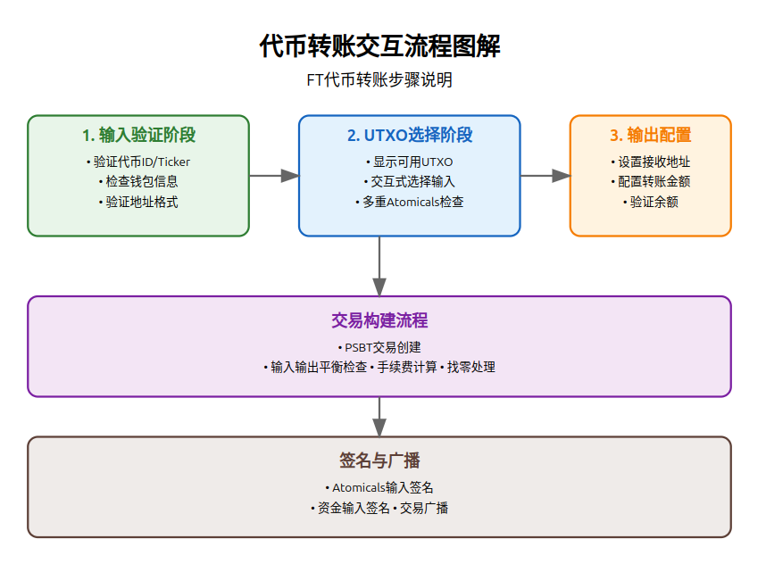
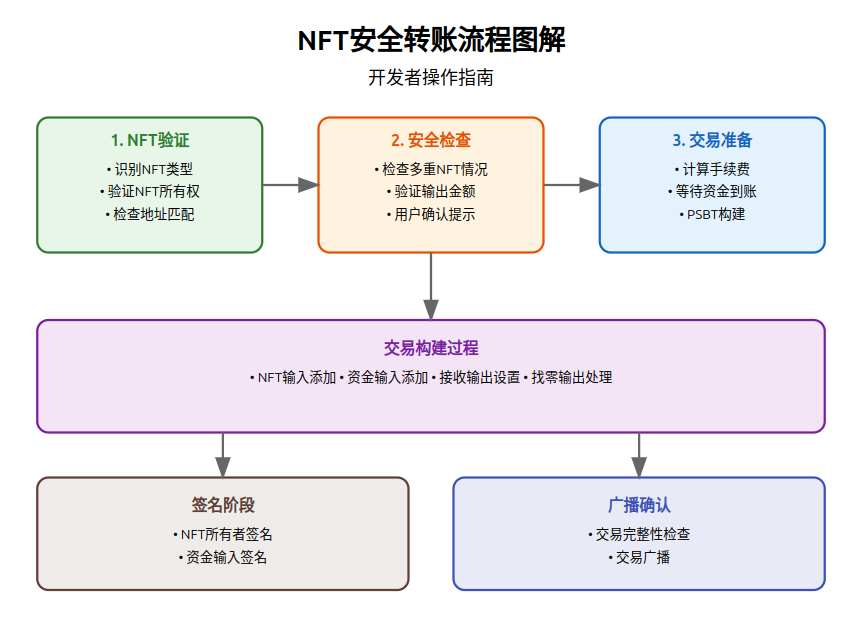
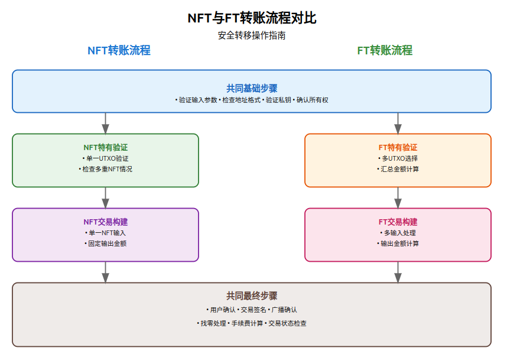
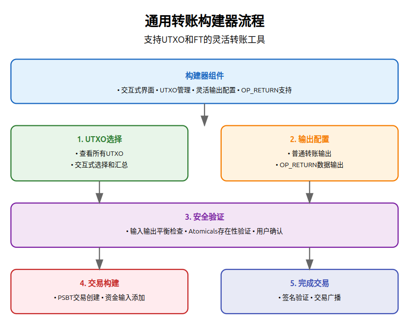

# Atomicals-js 转帐管理命令

## 转帐管理命令概述
该命令用于处理不同类型的转账操作，包括FT（同质化代币）、NFT（非同质化代币）及UTXO（未花费交易输出）的管理。用户可以通过交互式界面选择具体的转账参数，并执行安全的转账流程，确保资产的安全和正确性。


## 命令列表
- **[transfer-interactive-ft-command.ts](#transfer-interactive-ft-commandts)**  
  - 用于交互式转移FT（同质化代币）
- **[transfer-interactive-nft-command.ts](#transfer-interactive-nft-commandts)**  
  - 用于交互式转移NFT（非同质化代币）
- **[transfer-interactive-utxos-command.ts](#transfer-interactive-utxos-commandts)**  
  - 用于管理UTXO（未花费交易输出）
- **[transfer-interactive-builder-command.ts](#transfer-interactive-builder-commandts)**  
  - 用于构建和管理复杂的交易。

# transfer-interactive-ft-command.ts
## 功能概述
该命令用于交互式转移FT（同质化代币）。它提供了一个交互式界面，允许用户选择具体的UTXO进行转账，并支持多接收地址的转账操作。
## 主要步骤



1. 代币验证和初始化
```typescript
// 解析代币标识符
const atomicalType = getAtomicalIdentifierType(this.atomicalAliasOrId);
let cmd;
if (atomicalType.type === AtomicalIdentifierType.ATOMICAL_ID) {
  cmd = new GetCommand(this.electrumApi, atomicalType.providedIdentifier);
} else if (atomicalType.type === AtomicalIdentifierType.TICKER_NAME) {
  cmd = new GetByTickerCommand(this.electrumApi, atomicalType.tickerName);
}

// 获取代币信息
const cmdResult = await cmd.run();
const atomicalId = cmdResult.data.result.atomical_id;
const ticker = cmdResult.data.result.$ticker;
```
2. UTXO选择和验证
```typescript
// 获取地址余额摘要
const atomicalsInfo = await this.getBalanceSummary(atomicalId, address);

// 交互式选择UTXO
const selectedUtxos = await this.promptUtxoSelection(atomicalsInfo);

// 检查是否存在多重Atomicals
await this.promptIfDetectedMultipleAtomicalsAtSameUtxos(
  atomicalId, 
  selectedUtxos
);

// 计算选中的UTXO总额
const chosenSum = selectedUtxos.reduce(
  (accum, item) => accum + item.value, 
  0
);
```
3. 输出配置设置
```typescript
// 交互式设置接收地址和金额
const outputs: AmountToSend[] = await this.promptAmountsToSend(
  this.validatedWalletInfo, 
  chosenSum
);

// 验证输入输出平衡
if (!this.nofunding && remainingBalance !== 0) {
  throw new Error('输入输出金额不平衡');
}
```
4. 构建和发送交易
```typescript
// 创建PSBT交易
const psbt = new bitcoin.Psbt({ network: NETWORK });

// 添加代币输入
for (const utxo of transferOptions.selectedUtxos) {
  psbt.addInput({
    hash: utxo.txid,
    index: utxo.index,
    witnessUtxo: { 
      value: utxo.value, 
      script: Buffer.from(output, 'hex') 
    }
  });
}

// 添加接收输出
for (const output of transferOptions.outputs) {
  psbt.addOutput({
    value: output.value,
    address: output.address,
  });
}

// 签名和广播交易
psbt.signInput(0, keyPairAtomical.tweakedChildNode);
psbt.finalizeAllInputs();
const tx = psbt.extractTransaction();
const broadcastedTxId = await this.electrumApi.broadcast(tx.toHex());
```

## 使用示例
```typescript
const transferFt = new TransferInteractiveFtCommand(
  electrumApi,         // Electrum API实例
  {
    rbf: true,         // 启用RBF
    satsbyte: 10       // 每字节10聪
  },
  "$mytoken",         // 代币ID或Ticker
  "KxDQYWM...",       // 代币所有者私钥
  "KzABC...",         // 资金私钥
  walletInfo,         // 钱包信息
  10,                 // 每字节手续费率
  false               // 是否禁用资金输入
);

// 执行转账
try {
  const result = await transferFt.run();
  console.log('转账成功:', result.tx);
} catch (error) {
  console.error('转账失败:', error);
}
```

# transfer-interactive-nft-command.ts
## 功能概述
该命令用于安全转移NFT（非同质化代币）到新地址。它包含完整的安全检查机制，确保NFT转移过程的安全性和正确性。



## 主要步骤
1. NFT验证和地址检查
```typescript
// NFT类型识别
const atomicalType = getAtomicalIdentifierType(this.atomicalAliasOrId);
let cmd;
if (atomicalType.type === AtomicalIdentifierType.ATOMICAL_ID) {
  cmd = new GetCommand(this.electrumApi, atomicalType.providedIdentifier);
} else if (atomicalType.type === AtomicalIdentifierType.REALM_NAME) {
  cmd = new GetByRealmCommand(this.electrumApi, atomicalType.realmName);
}

// 验证接收地址格式
detectAddressTypeToScripthash(this.receiveAddress);

// 获取并验证NFT信息
const atomicalInfo = await this.electrumApi.atomicalsGetLocation(atomicalId);
const atomicalDecorated = decorateAtomical(atomicalInfo.result);
``` 
2. 安全性检查
```typescript
// 验证NFT所有权
if (!atomicalDecorated.location_info_obj.locations[0].address === p2tr.address) {
  throw `NFT由其他地址控制: ${atomicalDecorated.location_info_obj.locations[0].address}`;
}

// 检查是否存在多重NFT情况
if (atomicalDecorated.location_info_obj.locations[0].atomicals_at_location.length > 1) {
  throw `该地址存在多个Atomicals，请先使用splat命令分离`;
}

// 用户确认提示
const cont = await prompt("是否继续转账? 输入'y'确认: ");
if (cont.toLowerCase() !== 'y') {
  return { success: false, message: "已取消转账" };
}
``` 
3. 交易构建和签名
```typescript
async performTransfer(atomical, keypairAtomical, keypairFunding, satsbyte, satsoutput, receiveAddress) {
  // 创建PSBT交易
  const psbt = new bitcoin.Psbt({ network: NETWORK });
  
  // 添加NFT输入
  psbt.addInput({
    hash: location.txid,
    index: location.index,
    witnessUtxo: { 
      value: location.value, 
      script: Buffer.from(location.script, 'hex') 
    },
    tapInternalKey: keypairAtomical.childNodeXOnlyPubkey
  });

  // 添加资金输入并等待确认
  let utxo = await this.electrumApi.waitUntilUTXO(
    keypairFundingInfo.address, 
    expectedSatoshisDeposit, 
    5,
    false
  );

  // 设置接收输出
  psbt.addOutput({
    value: this.satsoutput,
    address: receiveAddress
  });

  // 添加找零输出（如果需要）
  if (utxo.value - expectedSatoshisDeposit >= 546) {
    psbt.addOutput({
      value: utxo.value - expectedSatoshisDeposit,
      address: keypairFundingInfo.address
    });
  }

  // 签名和广播
  psbt.signInput(0, keypairAtomical.tweakedChildNode);
  psbt.signInput(1, keypairFundingInfo.tweakedChildNode);
  psbt.finalizeAllInputs();
  const tx = psbt.extractTransaction();
  return await this.electrumApi.broadcast(tx.toHex());
}
``` 
## 使用示例
```typescript
// 创建NFT转账命令
const transferNft = new TransferInteractiveNftCommand(
  electrumApi,        // Electrum API实例
  {
    rbf: true         // 启用RBF
  },
  "atom:xxxxxx...",   // NFT ID或名称
  "KxDQYWM...",       // NFT所有者私钥
  "bc1q...",          // 接收地址
  "KzABC...",         // 资金私钥
  10,                 // 每字节手续费率（satsbyte）
  1000                // 转账金额（satsoutput）
);

// 执行转账
try {
  const result = await transferNft.run();
  console.log('转账成功:', result.data.txid);
} catch (error) {
  console.error('转账失败:', error);
}
```
# NFT与FT转账流程对比


UTXO处理方式
- NFT：
```typescript
// 单一UTXO验证
if (atomicalDecorated.location_info_obj.locations.length !== 1) {
  throw '期望NFT只有一个位置信息';
}

```
- FT：
```typescript
// 多UTXO选择和处理
const selectedUtxos = await this.promptUtxoSelection(atomicalsInfo);
const chosenSum = selectedUtxos.reduce((accum, item) => 
  accum + item.value, 0
);
```

# transfer-interactive-utxos-command.ts
## 功能概述
这个命令用于交互式管理和转移UTXO（未花费的交易输出），它提供了一个用户友好的界面，让开发者可以选择特定的UTXO进行转账操作，同时确保Atomicals资产的安全。


## 主要步骤
1. UTXO扫描和余额检查
```typescript
// 获取地址的UTXO列表
async getUtxoBalanceSummary(address) {
  const res = await this.electrumApi.atomicalsByAddress(address);
  const utxosFiltered = [];
  
  // 过滤掉包含Atomicals的UTXO
  for (const utxo of res.utxos) {
    if (!utxo.atomicals || !utxo.atomicals.length) {
      utxosFiltered.push({
        txid: utxo.txid,
        index: utxo.index,
        value: utxo.value,
        height: utxo.height
      });
    }
  }
  return { utxos: utxosFiltered };
}
```
2. 交互式UTXO选择
```typescript
async promptUtxoSelection(info) {
  let selectedUtxos = [];
  // 显示当前选择的总额
  const currentBalance = selectedUtxos.reduce(
    (accum, item) => accum + item.value, 0
  );
  
  // 提供选项
  console.log('选项:');
  console.log('* - 选择全部UTXO');
  console.log('f - 完成选择');
  console.log('数字 - 选择特定UTXO');
  
  // 处理用户输入
  switch (reply) {
    case '*':
      return info.utxos;
    case 'f':
      return selectedUtxos;
    default:
      // 添加特定UTXO
      selectedUtxos.push(info.utxos[parsedNum]);
      // 去重
      selectedUtxos = selectedUtxos.filter(onlyUnique);
  }
}
```
3. 接收方配置
```typescript
async promptAmountsToSend(walletInfo, availableBalance) {
  const amountsToSend = [];
  let remainingBalance = availableBalance;

  while (remainingBalance > 0) {
    // 显示当前状态
    console.log(`已累计金额: ${accumulated}`);
    console.log(`剩余金额: ${remainingBalance}`);

    // 验证输入金额
    if (valuePart < 546) {
      console.log('金额无效，最小值: 546');
      continue;
    }

    // 添加接收方
    amountsToSend.push({
      address: addressPart.address,
      value: valuePart
    });
    remainingBalance -= valuePart;
  }
  return amountsToSend;
}
```
4. 交易构建与发送
```typescript
async buildAndSendTransaction(transferOptions, keyPairInfo, fundingKeyPair, satsbyte) {
  const psbt = new bitcoin.Psbt({ network: NETWORK });
  
  // 添加输入
  for (const utxo of transferOptions.selectedUtxos) {
    psbt.addInput({
      hash: utxo.txid,
      index: utxo.index,
      witnessUtxo: {
        value: utxo.value,
        script: Buffer.from(output, 'hex')
      }
    });
  }

  // 添加输出
  for (const output of transferOptions.outputs) {
    psbt.addOutput({
      value: output.value,
      address: output.address
    });
  }

  // 签名和广播
  psbt.signAllInputs(keyPairInfo.tweakedChildNode);
  psbt.finalizeAllInputs();
  const tx = psbt.extractTransaction();
  return await this.electrumApi.broadcast(tx.toHex());
}
```
## 使用示例
```typescript
const transferUtxos = new TransferInteractiveUtxosCommand(
  electrumApi,        // Electrum API实例
  {
    rbf: true,        // 启用RBF
    satsbyte: 10      // 每字节10聪
  },
  "KxDQYWM...",       // UTXO所有者私钥
  "KzABC...",         // 资金私钥
  walletInfo,         // 钱包信息
  10,                 // 每字节手续费率
  false               // 是否禁用资金输入
);

try {
  const result = await transferUtxos.run();
  console.log('转账成功:', result.tx);
} catch (error) {
  console.error('转账失败:', error);
}
```

# transfer-interactive-builder-command.ts
## 功能概述
这是一个灵活的交互式转账构建器，支持同时处理普通UTXO和Atomicals资产。它的特点是提供更多的自定义选项，包括OP_RETURN输出和复杂的转账场景。



## 主要步骤
1. 初始化构建器
```typescript
const builder = new TransferInteractiveBuilderCommand(
  electrumApi,        // Electrum API实例
  {
    rbf: true,        // 启用RBF
    satsbyte: 10      // 每字节10聪
  },
  ownerWIF,           // 资产所有者私钥
  fundingWIF,         // 资金私钥
  walletInfo,         // 钱包信息
  10,                 // 手续费率
  false,              // 禁用资金输入
  atomicalId          // 可选：Atomical收据ID
);
``` 
2. UTXO分析和选择
```typescript
// 获取UTXO列表
const balanceInfo = await this.getUtxoBalanceSummary(address);

// 交互式选择UTXO
const selectedUtxos = await this.promptUtxoSelection(balanceInfo);

// 设置接收输出
const outputs = await this.promptAmountsToSend(
  validatedWalletInfo, 
  totalAmount
);
```
3. 配置特殊输出（OP_RETURN）
```typescript
// 添加OP_RETURN输出
if (splitted[0] === 'op_return') {
  const generalData = Buffer.from(splitted[1], 'utf8');
  const embed = bitcoin.payments.embed({ 
    data: [generalData] 
  });
  
  amountsToSend.push({
    opReturn: embed.output,
    value: 0
  });
}
```
4. 构建和发送交易
```typescript
// 创建PSBT交易
const psbt = new bitcoin.Psbt({ network: NETWORK });

// 添加输入
for (const utxo of transferOptions.selectedUtxos) {
  psbt.addInput({
    hash: utxo.txid,
    index: utxo.index,
    witnessUtxo: {
      value: utxo.value,
      script: Buffer.from(output, 'hex')
    }
  });
}

// 添加输出
for (const output of transferOptions.outputs) {
  if (output.opReturn) {
    psbt.addOutput({
      script: output.opReturn,
      value: 0
    });
  } else {
    psbt.addOutput({
      address: output.address,
      value: output.value
    });
  }
}
```
## 使用示例
```typescript
// 创建交易构建器实例
const builder = new TransferInteractiveBuilderCommand(
  electrumApi,           // Electrum API实例
  {
    rbf: true,          // 启用RBF
    satsbyte: 10        // 每字节10聪
  },
  "KxDQYWM...",         // UTXO所有者私钥
  "KzABC...",           // 资金私钥
  walletInfo,           // 钱包信息
  10,                   // 每字节手续费率
  false,                // 是否禁用资金输入
  "atom:xxx"            // 可选：收据ID
);

// 执行交易构建
try {
  const result = await builder.run();
  console.log('交易构建成功:', result.tx);
} catch (error) {
  console.error('交易构建失败:', error);
}
```


