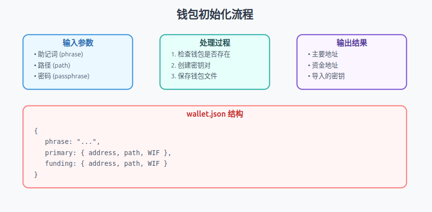
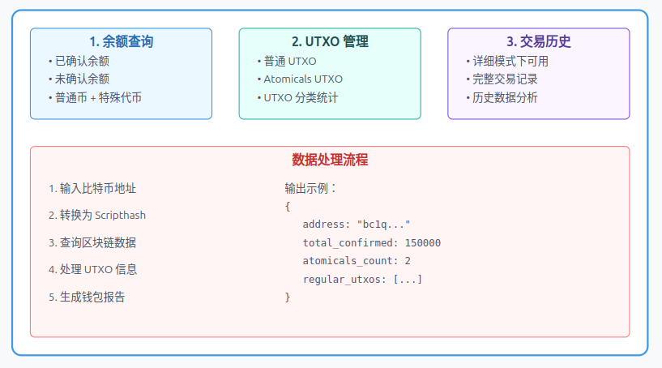
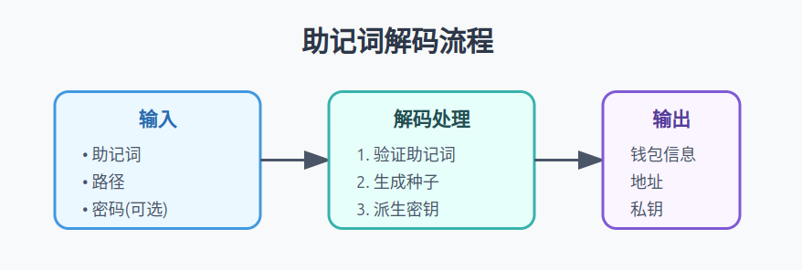

# Atomicals-js 钱包管理命令

## 钱包管理命令概述

钱包是您与比特币网络交互的基础。就像您的银行账户一样，它存储了您的数字资产。本文档详细介绍了所有钱包相关的命令操作。

## 命令列表
- **[wallet-init-command.ts](#wallet-init-commandts)**  
  - 用于初始化一个新的钱包，生成必要的密钥对并保存配置。
- **[wallet-create-command.ts](#wallet-create-commandts)**  
  - 用于创建额外的钱包实例，但不进行初始化配置。
- **[wallet-import-command.ts](#wallet-import-commandts)**  
  - 用于导入现有钱包的私钥或助记词。
- **[wallet-info-command.ts](#wallet-info-commandts)**  
  - 用于查询并显示钱包信息，例如余额、地址或密钥元数据。
- **[wallet-phrase-decode-command.ts](#wallet-phrase-decode-commandts)**  
  - 用于解码钱包的助记词（种子短语）以生成对应的密钥材料。


# wallet-init-command.ts
## 功能概述


1. 钱包存在性检查：
```typescript
async walletExists() {
    if (await jsonFileExists(walletPath)) {
        return true;
    }
}
```
2. 密钥对创建：

```typescript
const { wallet, imported } = await createPrimaryAndFundingImportedKeyPairs(
    this.phrase,
    this.path,
    this.passphrase,
    this.n
);
```
3. 钱包文件结构：

```typescript
interface WalletStructure {
    phrase: string;           // 助记词
    passphrase?: string;      // 密码（可选）
    primary: {                // 主要地址
        address: string;      // 地址
        path: string;         // 路径
        WIF: string;         // WIF格式私钥
    };
    funding: {                // 资金地址
        address: string;
        path: string;
        WIF: string;
    };
    imported: any;            // 导入的密钥
}
```

## 使用示例
```typescript
// 创建钱包实例
const walletInit = new WalletInitCommand(
    "your seed phrase",      // 助记词
    "m/44'/0'/0'",          // 路径
    "optional passphrase",   // 可选密码
    1                        // 可选数量
);

// 执行初始化
try {
    const result = await walletInit.run();
    console.log(result.data);
} catch (error) {
    console.error('钱包初始化失败:', error);
}
```

# wallet-create-command.ts
## 功能概述
`WalletCreateCommand` 是一个简单但重要的命令，用于创建新的比特币钱包密钥对。它与 `WalletInitCommand` 不同的是，它只生成密钥对而不保存到文件。

### 密钥对生成
- 直接调用 `createPrimaryAndFundingImportedKeyPairs` 工具函数
- 生成主要地址和资金地址的密钥对

# wallet-import-command.ts
## 功能概述
`wallet-import-command.ts` 实现了比特币钱包私钥导入功能，允许用户通过 WIF（Wallet Import Format）格式导入已存在的私钥，并为其分配别名。

## 主要步骤
1. 钱包检查:

```typescript
async walletExists() {
    if (await jsonFileExists(walletPath)) {
        return true;
    }
}
```
2. 导入过程:

```typescript
// 读取现有钱包文件
const walletFileData = await jsonFileReader(walletPath);

// 检查别名是否已存在
if (walletFileData.imported.hasOwnProperty(this.alias)) {
    throw `Wallet alias ${this.alias} already exists!`;
}

// 创建备份
await jsonFileWriter(
    walletPath + '.' + (new Date()).getTime() + '.walletbackup', 
    walletFileData
);
```
3. 密钥处理:

```typescript
// 从WIF创建密钥对
const importedKeypair = ECPair.fromWIF(this.wif);

// 创建Taproot地址
const { address, output } = bitcoin.payments.p2tr({
    internalPubkey: toXOnly(importedKeypair.publicKey),
    network: NETWORK
});
```

## 使用示例：
```typescript
// 创建导入命令实例
const importCommand = new WalletImportCommand(
    "KxDQYWM...private_key_wif",  // WIF私钥
    "savings-account"             // 别名
);

try {
    const result = await importCommand.run();
    console.log(`地址 ${result.data.address} 已导入为 ${result.data.alias}`);
} catch (error) {
    console.error('导入失败:', error);
}
```
# wallet-info-command.ts
## 功能概述

## 主要步骤
1. 余额查询功能 (Balance Query)：
```typescript
// 余额相关变量
let total_confirmed = 0;      // 已确认总额
let total_unconfirmed = 0;    // 未确认总额
let regular_confirmed = 0;    // 普通币已确认
let atomicals_confirmed = 0;  // 特殊代币已确认
```
2. UTXO 管理 (UTXO Management)：
```
// UTXO 分类存储
const plainUtxos: any[] = [];      	// 普通 UTXO 数组
const atomicalsUtxos: any[] = [];  	// 特殊代币 UTXO 数组

// UTXO 处理示例
for (const utxo of res.utxos) {
  if (utxo.atomicals && utxo.atomicals.length) {
    atomicalsUtxos.push(utxo);  	// 特殊代币
  } else {
    plainUtxos.push(utxo);      	// 普通币
  }
}
```

3. 交易历史查询 (Transaction History)：

```
// 详细模式下获取交易历史
if (this.verbose) {
  history = await this.electrumApi.history(scripthash);
}
```

## 使用示例：
```typescript
// 创建钱包信息命令实例
const wallet = new WalletInfoCommand(
  electrumApi,         // API 接口
  'bc1q....',         // 比特币地址
  true                // 是否需要详细信息
);

// 执行查询
const result = await wallet.run();

// 输出结果示例
console.log(result.data);
/* 输出格式
{
  address: 'bc1q....',           // 钱包地址
  scripthash: '7d8c...',        // 脚本哈希
  atomicals_count: 2,           // 特殊代币数量
  total_confirmed: 150000,      // 已确认总额
  regular_utxos: [...],         // 普通 UTXO 列表
  atomicals_utxos: [...],       // 特殊代币 UTXO 列表
  history: [...],               // 交易历史（详细模式）
}
*/
```


# wallet-phrase-decode-command.ts
## 功能概述


```typescript
export class WalletPhraseDecodeCommand implements CommandInterface {
    // 1️⃣ 构造函数：接收必要参数
    constructor(
        private phrase: string,     // 助记词
        private path: string,       // 派生路径
        private passphrase?: string // 可选密码
    ) {}

    // 2️⃣ 运行函数：执行解码过程
    async run(): Promise<CommandResultInterface> {
        const wallet = await decodeMnemonicPhrase(
            this.phrase, 
            this.path, 
            this.passphrase
        );
        return {
            success: true,
            data: wallet
        }
    }
}
```

## 使用示例
```typescript
// 创建解码命令
const decodeCommand = new WalletPhraseDecodeCommand(
    "apple banana cherry ...", // 你的12/24个助记词
    "m/44'/0'/0'/0/0",        // BIP44路径
    "optional passphrase"      // 可选密码
);

// 执行解码
try {
    const result = await decodeCommand.run();
    if (result.success) {
        const { address, privateKey } = result.data;
        console.log('钱包地址:', address);
    }
} catch (error) {
    console.error('解码失败:', error);
}
```
