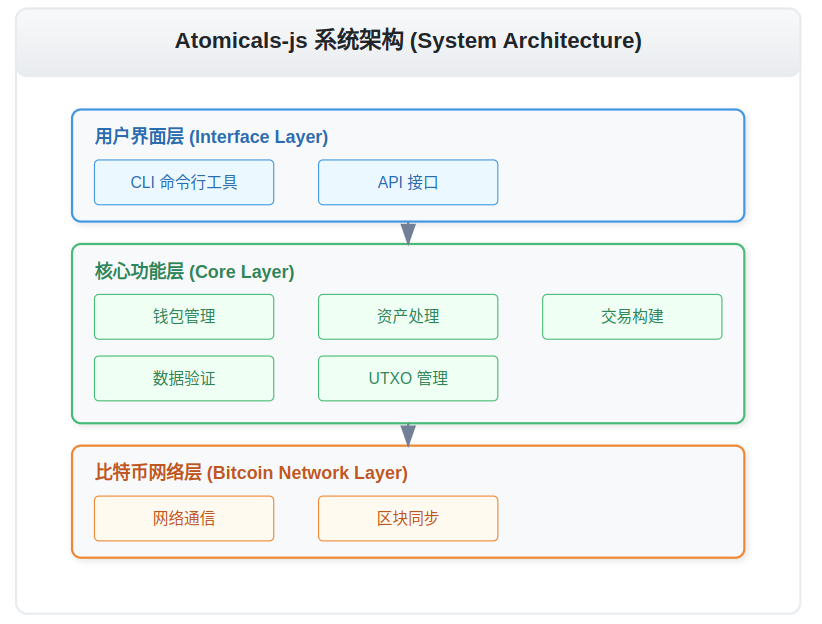

# Atomicals-js 文档中心


### 核心文档
- [钱包管理命令](./atomical-js/WalletCommands/钱包管理命令.md): 
管理用户的钱包，包括创建、导入和查看钱包信息。
- [铸造命令](./atomical-js/MintingCommands/铸造命令.md): 
用于创建和发行新的数字资产，如代币和NFT。
- [转账命令](./atomical-js/TransferCommands/转账命令.md): 
处理资产的转移，包括FT和NFT的转账操作。
- [数据管理命令](./atomical-js/DataManagementCommands/数据管理命令.md): 
处理数据的创建、读取、更新和删除（CRUD）操作。
- [查询命令](./atomical-js/QueryCommands/查询命令.md): 
执行针对区块链数据的查询，返回相关信息。

## 项目概述

Atomicals-js 是一个用于在比特币网络上创建和管理数字资产的 JavaScript/TypeScript 工具库。它提供了完整的命令行界面（CLI）和程序化 API，让开发者能够方便地操作 Atomicals 协议中的各类数字资产。

### 主要特性
- 支持多种数字资产类型管理
- 完整的钱包功能
- 安全的密钥管理
- 灵活的交易处理
- 丰富的查询接口

## 核心组件

### 1. 基础架构
项目采用模块化设计，主要包含以下核心目录：

```html
/lib
  ├── api/          // API 接口实现
  ├── commands/     // CLI 命令实现
  ├── utils/        // 工具函数
  ├── interfaces/   // TypeScript 接口定义
  ├── types/        // 类型定义
  ├── browser/      // 浏览器相关实现
  ├── cli.ts        // CLI 入口
  └── index.ts      // 库入口
```

```html2
/lib/commands/                                 # 命令根目录
├── Core Interfaces                           # 核心接口定义
│   ├── command.interface.ts                  # 定义所有命令必须实现的基本接口
│   └── command-result.interface.ts           # 定义命令执行结果的标准格式
│
├── Wallet Management                         # 钱包管理命令
│   ├── wallet-init-command.ts               # 初始化新钱包
│   ├── wallet-create-command.ts             # 创建钱包
│   ├── wallet-import-command.ts             # 导入已有钱包
│   ├── wallet-info-command.ts               # 查看钱包信息
│   └── wallet-phrase-decode-command.ts      # 解码助记词
│
├── Minting Commands                          # 铸造相关命令
│   ├── Fungible Tokens (FT)                 # 同质化代币操作
│   │   ├── mint-interactive-ft-command.ts   # 交互式铸造FT
│   │   ├── init-interactive-dft-command.ts  # 初始化分布式FT
│   │   ├── init-interactive-fixed-dft       # 初始化固定供应量DFT
│   │   └── init-infinite-dft-command.ts     # 初始化无限供应量DFT
│   │
│   ├── Non-Fungible Tokens (NFT)            # 非同质化代币操作
│   │   ├── mint-interactive-nft-command.ts  # 交互式铸造NFT
│   │   ├── mint-interactive-container       # 铸造容器
│   │   └── mint-interactive-dat-command.ts  # 铸造数据型NFT
│   │
│   └── Realm & Subrealm                     # 域名空间操作
│       ├── mint-interactive-realm           # 铸造顶级域名
│       ├── mint-interactive-subrealm        # 铸造子域名
│       ├── mint-subrealm-direct            # 直接铸造子域名
│       └── mint-subrealm-with-rules        # 带规则铸造子域名
│
├── Transfer Commands                         # 转账相关命令
│   ├── transfer-interactive-ft-command.ts   # FT转账
│   ├── transfer-interactive-nft-command.ts  # NFT转账
│   ├── transfer-interactive-utxos           # UTXO转账
│   └── transfer-interactive-builder         # 自定义转账构建器
│
├── Query Commands                           # 查询相关命令
│   ├── Address Queries                      # 地址查询
│   │   ├── address-history-command.ts      # 查询地址历史
│   │   ├── address-info-command.ts         # 查询地址信息
│   │   └── get-atomicals-address           # 查询地址Atomicals
│   │
│   ├── Atomical Queries                     # Atomical资产查询
│   │   ├── get-by-container-command.ts     # 按容器查询
│   │   ├── get-by-realm-command.ts         # 按域名查询
│   │   ├── get-by-ticker-command.ts        # 按代币符号查询
│   │   ├── get-container-items             # 查询容器内容
│   │   ├── get-dft-info-command.ts         # 查询DFT信息
│   │   └── get-subrealm-info               # 查询子域名信息
│   │
│   └── Global Queries                       # 全局查询
│       ├── get-command.ts                   # 通用查询
│       └── get-global-command.ts            # 全局状态查询
│
├── Management Commands                       # 管理类命令
│   ├── Subrealm Management                  # 子域名管理
│   │   ├── enable-subrealm-rules           # 启用子域名规则
│   │   ├── disable-subrealm-rules          # 禁用子域名规则
│   │   └── pending-subrealms               # 待处理子域名
│   │
│   ├── Container Management                 # 容器管理
│   │   ├── set-container-data              # 设置容器数据
│   │   └── set-container-dmint             # 设置容器铸造规则
│   │
│   └── Other Management                     # 其他管理功能
│       ├── resolve-command.ts               # 解析命令
│       ├── seal-interactive-command.ts      # 封装交互式命令
│       ├── set-interactive-command.ts       # 设置交互式命令
│       └── set-relation-interactive         # 设置关联关系
│
├── Utility Commands                         # 实用工具命令
│   ├── await-utxo-command.ts               # 等待UTXO确认
│   ├── broadcast-command.ts                 # 广播交易
│   ├── create-dmint-command.ts             # 创建分布式铸造
│   ├── decode-tx-command.ts                # 解码交易
│   ├── download-command.ts                 # 下载命令
│   ├── merge-interactive-utxos.ts          # 合并UTXO
│   ├── render-previews-command.ts          # 渲染预览
│   ├── server-version-command.ts           # 服务器版本
│   ├── splat-interactive-command.ts        # 拆分命令
│   ├── split-interactive-command.ts        # 分割命令
│   └── tx-command.ts                       # 交易命令
│
├── Search Commands                          # 搜索相关命令
│   ├── search-containers-command.ts        # 搜索容器
│   ├── search-realms-command.ts            # 搜索域名
│   └── search-tickers-command.ts           # 搜索代币符号
│
└── Utility Files                           # 工具文件
    ├── command-helpers.ts                  # 命令辅助函数
    └── witness_stack_to_script_witness.ts  # 见证栈转换工具
```

### 2. 关键依赖
核心依赖包含：

```json
{
  "dependencies": {
    "bitcoinjs-lib": "^6.1.0",    // 比特币操作库
    "bip32": "^3.1.0",            // 密钥派生
    "bip39": "^3.1.0",            // 助记词管理
    "electrum-client": "^1.1.0",   // ElectrumX 客户端
    "commander": "^9.4.1"          // CLI 框架
  }
}
```

## 开发环境配置

### 1. 环境准备
首先需要配置开发环境：

```bash
# 安装依赖
yarn install

# 配置环境变量
cp .env.example .env

# 编译项目
yarn build
```

### 2. 钱包配置
创建并配置钱包：

```typescript
// 初始化钱包
const initWallet = async () => {
  const mnemonic = generateMnemonic();  // 生成助记词
  const wallet = await Wallet.fromMnemonic(mnemonic);
  
  console.log("钱包地址:", wallet.address);
  console.log("请妥善保管助记词:", mnemonic);
};
```

## 常用命令指南

### 1. 钱包管理命令 (Wallet Management)
钱包是您与比特币网络交互的基础。就像您的银行账户一样，它存储了您的数字资产。

```bash
# 创建新钱包（就像开设新的银行账户）
yarn cli wallet-create

# 初始化钱包配置文件
yarn cli wallet-init

# 导入已有钱包（类似于在新设备上登录您的账户）
yarn cli wallet-import <私钥> <别名>

# 查看钱包余额
yarn cli balances
```

### 2. 地址操作命令 (Address Operations)
地址就像您的银行账号，用于接收和发送数字资产。

```bash
# 查询地址信息（就像查看账户详情）
yarn cli address <地址>

# 查看地址的所有UTXO（未花费的交易输出，类似于账户中的零钱）
yarn cli address-utxos <地址>

# 查看地址历史（类似于查看账单记录）
yarn cli address-history <地址>
```

### 3. 资产管理命令 (Asset Management)

#### NFT 操作
非同质化代币(NFT)就像独一无二的艺术品或收藏品。

```bash
# 创建新的NFT（类似于创作一件艺术品）
yarn cli mint-nft <配置文件>

# 转移NFT到新地址（类似于将艺术品送给他人）
yarn cli transfer-nft <NFT编号> <接收地址>
```

#### FT（同质化代币）操作
同质化代币类似于货币，每个单位都是相同的。

```bash
# 创建新代币（类似于发行新的货币）
yarn cli mint-ft <代币符号> <供应量> <配置文件>

# 转移代币（类似于转账）
yarn cli transfer-ft <代币编号>
```

### 4. 域名系统命令 (Realm System)
域名系统类似于互联网的域名，提供易记的名称。

```bash
# 注册顶级域名（类似于注册.com域名）
yarn cli mint-realm <域名>

# 注册子域名（类似于注册子域名，如 blog.example.com）
yarn cli mint-subrealm <子域名>
```

### 5. 容器操作命令 (Container Operations)
容器就像一个数字化的收藏夹，可以存储多个相关的数字资产。

```bash
# 创建新容器（类似于创建新的收藏夹）
yarn cli mint-container <容器名称>

# 查看容器内容（类似于浏览收藏夹）
yarn cli get-container <容器名称>
```

### 实用技巧

1. **命令帮助**
```bash
# 查看任何命令的详细帮助
yarn cli help <命令名称>
```

2. **常见操作流程**

初学者建议按以下顺序学习：

a) 钱包管理
```bash
# 第一步：创建钱包
yarn cli wallet-create

# 第二步：查看余额
yarn cli balances
```

b) 创建第一个NFT
```bash
# 准备NFT配置文件 config.json
{
  "name": "我的第一个NFT",
  "description": "这是一个测试NFT",
  "image": "ipfs://..."
}

# 铸造NFT
yarn cli mint-nft config.json
```